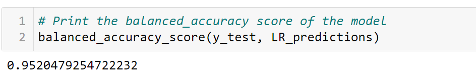

# Module 12 Report 

## Overview of the Analysis

  * The purpose of this analysis is to build a model that can identify the creditworthiness of borrowers.

  * A dataset of historical lending activity from a peer-to-peer lending services company was used. 

  * Dependant variable (y value) in this analysis was the "loan status" indicating if a loan is healthy or at risk. Independent Variables (x values) were loan size, interest rate, borrower income, debt-to-income ratio, number of accounts and derogatory marks.

  * In this analysis, we first split our data into training and test sets. Then, define our dependent and independent variables. Next, we create a logistic regression model and fit our original data to this model. The trained model is used to make predictions. Lastly, we evaluate the model`s performance. 

  * Two different Logistic Regression models were created by using the original data set and randomly over-resampled data set (to get rid of the imbalances). In the end, their results -which were gathered with scikit-learn library- were compared.

## Results

* Logistic Regression Model with Original Data :

The model generated an accuracy score of 95% but could be improved due to the dataset being imbalanced.
  

  

* Logistic Regression Model with Randomly Oversampled Data:

The model generated an accuracy score of 99% due to the dataset being balanced.
  

## Summary

Analysis shows that collected data can be effectively used to train and test the Machine Learning Classification Model, for better predictions solving the imbalance sampling issue is needed.

Randomly oversampling the data helps us to get higher balanced accuracy and recall scores. With a higher recall value, a model can predict risky loans more accurately.

With incorrect predictions, we have two issues:

* False positives (where users are flagged as risky, but are actually healthy)
* False negatives (where users are not flagged as risky but are actually risky)

both cases have their costs. It is important to predict both 1s and 0s. Therefore, a model should have good accuracy in terms of both.